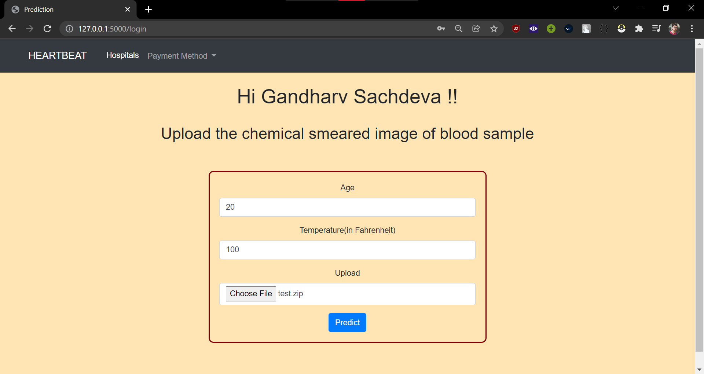

# Software-Engineering-Project

Malaria detection using image classification

Transfer learning fine-tuning based using InceptionV3 (keras with tensorflow as backend)

Classifiy image of smeared blood to classify between parasitic and uninfected blood samples.

Fronted using Bootstrap, HTML

Backend using Python, flask

MongoDB as Database

## Screenshots

Login

Signup

Prediction

Diagnosis

Email Notification

